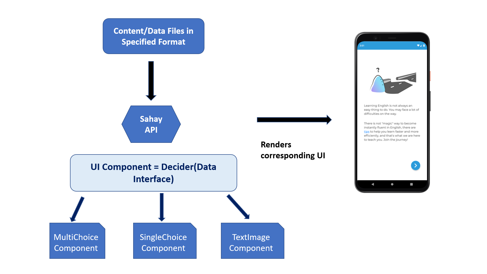

## Sahay App Toolkit

A react-native framework that provides a suite of UI Components that can help you setup any content related application.


### [Sahay Poster](SAHAY_POSTER.pdf)


--------------------------------

### Motivation
Content based apps are prevalent in various domains ranging from fitness based apps, language learning course based applications to mental health or meditation based applications. Sahay *Hindi- meaning enabling/empowering framework* for empoweringdevelopers to build content based applications 

--------------------------------

### API Functionality




#### How to build your own App ?

```
git clone https://github.com/microsoft/sahay-app-toolkit.git
cd Sahay
npm install
```

Next if you want to create your own component of type say multichoice component

```
export const customMultiChoice = () : ReactElement => {

    return(
        <SahayFrameWork data={yourContent} themeColor={yourPreferedColor} type={componentTypes.MULTI_CHOICE_COMPONENT}/>
        )

}
```

If you want this to be under your Navigation, simply click on [AppNavigator](Sahay/src/AppNavigator) and add the corresponding scene

```


  <Scene
    key={NavigationScenes.YOUR_MULTICHOICE_COMPONENT}
    component={SahayFramework}
    title="Your Component Name"
    />

```

and add this in your [AppNavigator.types](Sahay/src/AppNavigator/AppNavigator.types.ts)

```

export enum NavigationScenes {
 YOUR_MULTICHOICE_COMPONENT = 'MultiChoiceComponentName'
}


```

### [Sahay visualization Framework](microsoft.github.io/sahay-app-toolkit/customPalette.html)

Along with this we also share a visualization tool for designers/developers to build app components by simple drag and drop, which can be later integrated with the app.

--------------------------------


### Examples 

<p float="left">
  
  
   
</p>

*A sample application for enabling users with English speaking skills using the Sahay app framework*


### Dependencies

All Libraries used are majorly from the react-native-community umbrella and holds corresponding license information under _MIT License_.
For a complete updated list of libraries being used, check [package.json](Sahay/package.json)

### Contributing

This project welcomes contributions and suggestions. Most contributions require you to agree to a
Contributor License Agreement (CLA) declaring that you have the right to, and actually do, grant us
the rights to use your contribution. For details, visit https://cla.opensource.microsoft.com.

When you submit a pull request, a CLA bot will automatically determine whether you need to provide
a CLA and decorate the PR appropriately (e.g., status check, comment). Simply follow the instructions
provided by the bot. You will only need to do this once across all repos using our CLA.

This project has adopted the [Microsoft Open Source Code of Conduct](https://opensource.microsoft.com/codeofconduct/).
For more information see the [Code of Conduct FAQ](https://opensource.microsoft.com/codeofconduct/faq/) or
contact [opencode@microsoft.com](mailto:opencode@microsoft.com) with any additional questions or comments.
